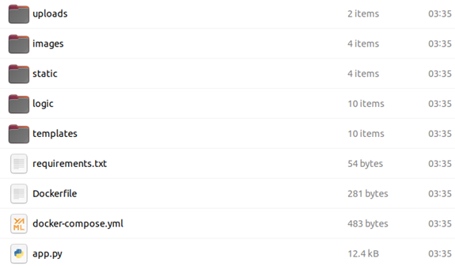
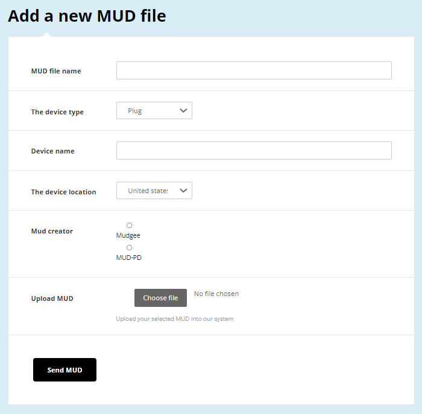
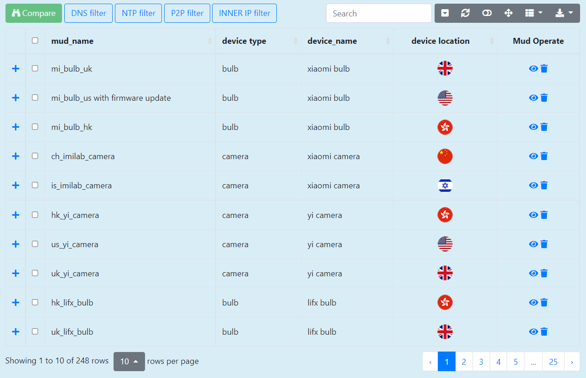
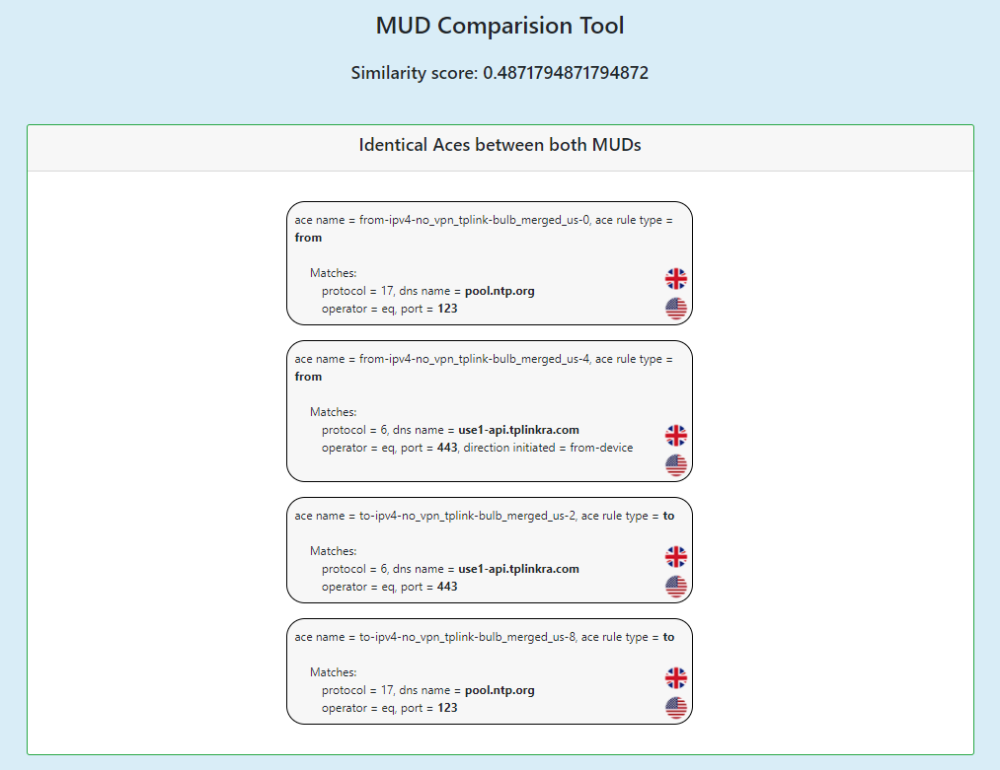
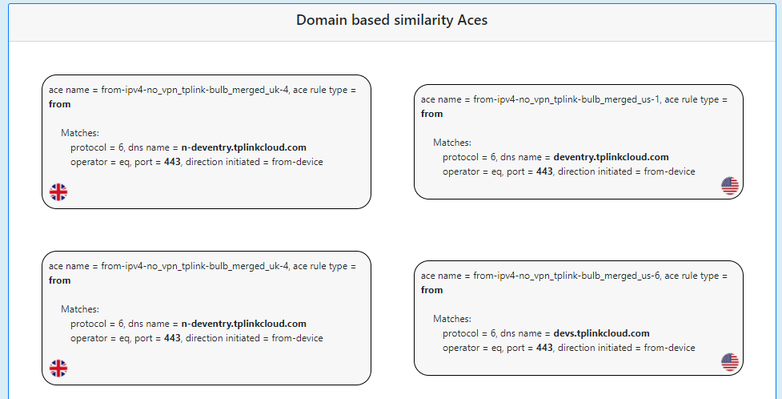
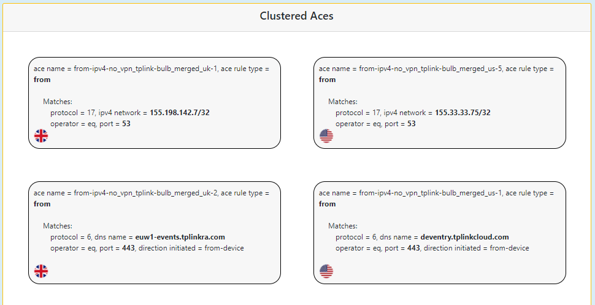

# MUDIS

### What is MUDIS and why should you use it?

MUDIS - MUD Inspection System is a tool that compares the network behavior of IOT devices, based on their formal description in the MUD file
MUDIS tool introduces comparison and generalization features, allowing users to investigate MUD files differences.<br><br>
This tool and all algorithems within are explained and developed to promote the our paper that was accepted to **The 18th IEEE/IFIP Network Operations and Management Symposium (NOMS 2022)**

Add the paper here!

## Installation guide ##

### Overview

MUDIS is a web application tool based on a **Flask server** (python code) and **MongoDB** (saves MUDS for your future use). <br>
Inorder to help researchers out there I have created a detailed setup and installation guide that can be find here. <br>
This guide will show you how to setup MUDIS in a quick and easy way by using **Docker compose** that will “setup&install” your entire environment in a few simple steps.<br>
All the needed files are in this repository under MUDIS setup folder for our users use!

### Prerequisite

Make sure you have already installed both Docker Engine and Docker Compose. You don’t need to install Python or MongoDB, as both are provided by Docker images.

#### Some recommendations:
- I recommend doing it on a Linux server (I used a VM with UBUNTU) but you can also run docker on your Windows or Mac
- You need to install **Docker Engine and Docker Compose** at that order. Go over this to manuals and read them carefully, if you will do it line by line you will see it work like a charm
  - Docker Engine - https://docs.docker.com/engine/install/ubuntu/
  - Docker Compose - https://docs.docker.com/compose/install/

### Step 1: Setup
- Create a directory for the project:
```bash
$ mkdir MUDIS
$ cd MUDIS
```
- Inside your project folder, add the files presneted in this git:
  - **All MUDIS** code with the main application file called app.py.
  - **Docker-compose.yml** which tells the docker compose the environment it needs to install and run.
  - **DockerFile** that uploads the code into the docker container, installs all the application requirements and Runs MUDIS application.
  - **requirements.txt** that holds all MUDIS requirements and needs to be installed before MUDIS can run.

So, the result of your MUDIS project folder should look like this:



### Step 2: Build and run your app with Compose
- From your project directory, start up your application by running `docker-compose up`
- Enter http://localhost:5000/ in a browser to see the application running

### Step 3: Start adding MUDs into the system and compare them using MUDIS

That is all! You can run MUDIS in only three simple steps and get all the benefit out of it


## So, what can it do (or what are MUDIS features)? ##
Motivated by the impact of location on the MUD, we built
this tool, which as few fundamental features:

<details><summary><b>ADD A NEW MUD</b></summary>
<p>

This is a basic feature that gives researchers the option to add MUDS into the system.<br>
The uploaded MUD is then saved at the server and in a dedicated MongoDB for further use.<br>
When adding a new MUD you can add some helpful metadata like - device name, device type, the device geolocation etc.

</p>
</details>
  
<details><summary><b>MUD PARSER</b></summary>
<p>

The basic concept of MUDIS is its parsing engine which gives MUDIS its power.<br>
The parsing engine knows how that take a raw MUD file and convert it into python objects that defines the given MUD.<br>
Once MUDIS proccess the MUD it creates - Matches objects, Aces objects, ACLs and so on.<br>
This objects above creates a MUD object that MUDIS will use in the more complex features it has.

</p>
</details>
  
<details><summary><b>COMPARE MUDS</b></summary>
<p>

Once you done uploading two or more MUDs you can start using one of the main feature of MUDIS, the comparison feature.<br>
This feature is using the MUD object that was created using the MUDIS parsing engine (explained in the previous section) to find the followin things:
<ul>  
  <li><b>Identical ACEs</b> - these are ACEs that exsists in both MUDs compared together.</li>
  <li><b>Domain based similarity ACEs</b> - these are ACEs from both MUDs that has similar domains (More about similarity in our paper) with the ame port and protocol.</li>
  <li><b>Clustered ACEs</b> - This ACEs are being paired based on their port+protocol similarity or by their IPs similarity of by domains similarity with a different port</li>
  <li><b>Dissimilar ACEs</b> - ACEs that has now given similarity with ACEs on the other MUD that we compared to.</li>
</ul>
In addition, the comparison results in a similarity score that the researcher can use to asstimaate how identical are the two MUDs.<br>
This is an importent metric that we used during our research (moreover inside our paper)

To conclude, MUD comparison allows the research to calculates the MUD similarity measure and then examine the differences between two MUD
files and highlight similar entries. This allows us to drill down and gain insights about the origin of the differences.
  
</p>
</details>
  
<details><summary><b>GENERALIZE MUDS</b></summary>
<p>

This feature aims to create a one comprehensive, generalized MUD  that can serve as a white-list for the network behavior of bothMUDs (represent two locations in our experiments).<br>
The generalization process is done by using the comparison feature that "learns" are are the MUDs differences and what can be generalized by MUDIS. <br>
The generalized MUD is then presented and inserted into MUDIS DataBase for future research and use of the given user.
  
</p>
</details>
  
<details><summary><b>BONUS FEATURES</b></summary>
<p>

MUDIS also presents two features that help us the reaerchers to automatre our work and to get our results right:
* ACEs filter - this gives the user to filter out ACEs that are created and influenced by the network and not by the device (therefore, harming the results).
* List comparison - this allows the users to compare a list of tuples where each tuple is two MUDs we want to compare. this comparison returns all similarity score for further use like creating graphs, detecting anomalies and so on.
  
</p>
</details>


## Screens examples ##

We have added some screen examples for you to get the look and feel of MUDIS. <br>
We really encourage you to install it and try it by yourself.

<details><summary><b>ADD MUD SCREEN</b></summary>
<p>

<br>
<em>Add a new MUD screen - gives users the ability to add new generated MUDs into the system for further investigation</em>
 
</p>
</details>

<details><summary><b>HOME PAGE SCREEN</b></summary>
<p>

<br>
<em>MUDIS main screen - gives users the ability to choose two MUDs and to compare, generalize and filter ACEs using the system</em>
 
</p>
</details>

<details><summary><b>SIMILARITY SCORE AND IDENTICAL ACEs</b></summary>
<p>

<br>
<em>MUDIS compare screen - shows the two MUDs similarity score and the identical ACEs between them</em>
 
</p>
</details>

<details><summary><b>DOMAIN BASED SIMILARITY ACEs</b></summary>
<p>

<br>
<em>MUDIS compare screen - shows the two MUDs domain based similarity ACEs</em>
 
</p>
</details>

<details><summary><b>CLUSTERED ACEs</b></summary>
<p>

<br>
<em>MUDIS main screen - shows the two MUDs clustered ACEs</em>
 
</p>
</details>

<details><summary><b>DISSIMILAR ACEs</b></summary>
<p>

<br>
<em>MUDIS main screen - shows the two MUDs dissimilar ACEs</em>
 
</p>
</details>

## Citation

If you find this tool useful in your research, please consider citing our papers:

```
@inproceedings{bremler2021poster,
  title={Poster: IoT Location Impact on Network Behavior and MUD},
  author={Bremler-Barr, Anat and Meyuhas, Bar and Shister, Ran},
  year={2021},
  booktitle={IMC Conference},
  publisher = {ACM}
}
```
